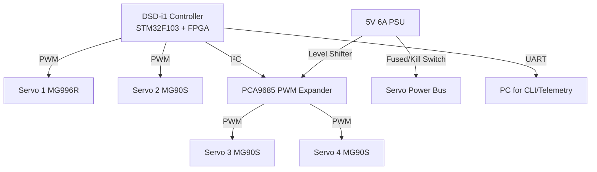
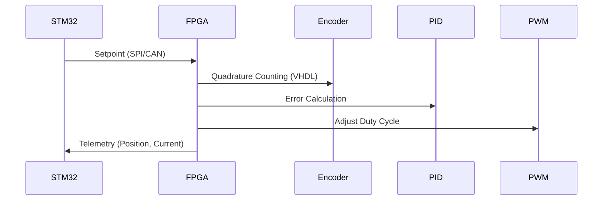

# **4-DOF Robotic Arm Prototype — Educational Edition v1.0**  

[](https://opensource.org/licenses/Apache-2.0)  

## ⚠️ **Critical Safety Notice**  
**Electrical Safety:**  
- Use **bidirectional logic-level shifters** for I²C/PWM signals between 5V devices (PCA9685) and 3.3V STM32.  
- Servo power **MUST** use fused external 5V PSU (>6A) with kill switch.  
**Mechanical Safety:**  
- Verify joint limits before powering servos.  
- Install mechanical stops to prevent over-rotation.  

---

## **Executive Summary**  
This repository documents the design of a 4-DOF robotic arm prototype using **STM32F1 + FPGA (DSD-i1)** for PWM control. Designed for educational use at HOU's Mobile Computing Lab, it features:  
- **Phase 1:** Open-loop control with hobby servos (MG90S/MG996R)  
- **Phase 2 Roadmap:** Closed-loop control with encoders + FPGA-accelerated PID  
- **Industrial-Grade Practices:** Safety protocols, validation KPIs, and upgrade path  

---

## **Table of Contents**  
1. [System Architecture](#1-system-architecture)  
2. [Professional BOM](#2-professional-bom)  
3. [Wiring & Power](#3-wiring--power)  
4. [Firmware Implementation](#4-firmware-implementation)  
5. [Calibration & Validation](#5-calibration--validation)  
6. [Phase 2 Roadmap](#6-phase-2-roadmap)  
7. [Repository Structure](#7-repository-structure)  
8. [Next Steps](#8-next-steps)  
9. [License & Contact](#9-license--contact)  

---

## **1. System Architecture**  

**Key Interfaces:**  
- **PWM Generation:** STM32 Timers (72 MHz) → 50 Hz, 1μs resolution  
- **FPGA Future Use:** Quadrature decoding for encoders (VHDL module)  
- **Safety:** Current/temperature monitoring (ADC channels)  

---

## **2. Professional BOM**  
**Core Components (Phase 1)**  
| Item | Specification | Qty |  
|------|--------------|-----|  
| DSD-i1 Dev Board | STM32F103 + Cyclone IV FPGA | 1 |  
| Servos | MG996R (Base), MG90S (Joints 2-4) | 4 |  
| Power Supply | 5V 6A PSU w/ Overcurrent Protection | 1 |  
| Logic Level Shifter | TXS0108E (Bidirectional) | 1 |  
| Fuse | 6A Fast-Blow | 1 |  
| Kill Switch | SPST High-Current | 1 |  

**Mechanical Assembly**  
- 3D-Printed Brackets ([STL Files](/hardware/cad))  
- Axial Bearings (ID 6mm)  
- Payload Capacity: **100g @ 15cm** (τ = m×g×L = 0.1×9.8×0.15 ≈ 0.15 Nm)  

---

## **3. Wiring & Power**  
**Power Distribution**  
```  
PSU +5V → [Fuse 6A] → [Kill Switch] → Servo V+  
PSU GND → Common GND Bus → DSD-i1 GND  
```  

**Signal Routing**  
| Signal | Path | Voltage |  
|--------|------|---------|  
| STM32 I²C | STM32 → Level Shifter → PCA9685 | 3.3V → 5V |  
| PWM Output | PCA9685 → Servo SIGNAL | 5V |  
| Direct PWM | STM32 → Servo SIGNAL | 3.3V (verify servo tolerance) |  

> **⚠️ Critical:** Never power servos from DSD-i1's USB!  

---

## **4. Firmware Implementation**  
**Key Files**  
```  
/firmware  
  /Core          # CubeMX HAL  
  /App  
    pwm_control.c    # Integer PWM setters  
    i2c_pca9685.c    # Level-shifted I²C driver  
    cli.c            # Command interface  
```  

**Efficient PWM Control (No Float!)**  
```c  
// Set servo pulse in microseconds (1.5ms = 1500µs)  
void set_servo_us(TIM_HandleTypeDef *htim, uint32_t channel, uint16_t us) {  
  __HAL_TIM_SET_COMPARE(htim, channel, us);  
}  

// PCA9685 I²C Write (with level-shifted safety)  
HAL_StatusTypeDef pca9685_write(I2C_HandleTypeDef *hi2c, uint8_t reg, uint8_t data) {  
  uint8_t buf[2] = {reg, data};  
  return HAL_I2C_Master_Transmit(hi2c, PCA_ADDR << 1, buf, 2, 100);  
}  
```  

**CLI Commands**  
```  
SERVO 2 1500    # Set Servo 2 to 1500µs  
CALIB J1         # Start calibration for Joint 1  
SAFELIMITS 1 900 2100  # Set software limits  
```  

---

## **5. Calibration & Validation**  
**Calibration Procedure**  
1. **Neutral Position:** `SERVO [id] 1500`  
2. **Sweep Limits:** Gradually move from 1000→2000µs, record min/max  
3. **Angle Mapping:**  
   ```json  
   {"joint1": {"min_us": 900, "max_us": 2100, "max_deg": 180}}  
   ```  

**Phase 1 Validation KPIs**  
| Metric | Target | Test Method |  
|--------|--------|-------------|  
| Repeatability | ±5° (visual) | Return-to-home test |  
| PWM Jitter | <10µs | Oscilloscope measurement |  
| Thermal Stability | <60°C | IR thermometer after 10min ops |  
| Current Draw (idle) | <500mA | Bench PSU monitoring |  

---

## **6. Phase 2 Roadmap**  
**FPGA-Accelerated Control**  


**Milestones**  
1. Add AMT102-V encoders (1024 CPR) to Joints 1-2  
2. Implement VHDL quadrature decoder  
3. Offload PID to FPGA (100kHz update rate)  
4. Integrate ODrive for closed-loop torque control  

---

## **7. Repository Structure**  
```  
/docs  
  SAFETY.md             # Risk assessment template  
  validation_report.pdf # Sample KPI report  
/hardware  
  /cad                  # STL files for 3D printing  
  wiring_diagram.pdf    # Production-grade schematics  
/firmware  
  CubeMX.ioc            # STM32 configuration  
  /App                  # Core application code  
/scripts  
  calibrate_arm.py      # Joint calibration utility  
  kpi_analyzer.py       # Validation log parser  
```  

---

## **8. Next Steps**  
- [ ] Assemble Phase 1 prototype using STL files  
- [ ] Collect thermal/current validation data  
- [ ] Integrate Bluetooth control (HC-05 module)  
- [ ] Develop MATLAB GUI for kinematics simulation  
- [ ] Implement encoder feedback on Joint 1  

---

## **9. License & Contact**  
**License:** [Apache 2.0](/LICENSE) - Open for academic/industrial collaboration  
**Project Lead:** Steve Stavros Prokovas  
**Affiliation:** Laboratory of Digital Systems, Hellenic Open University  
